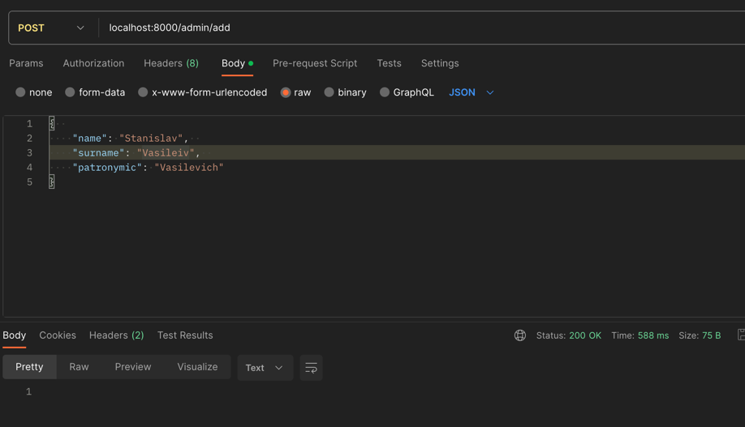
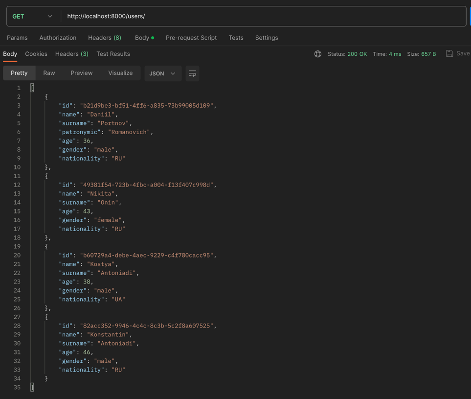
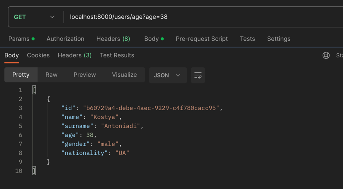
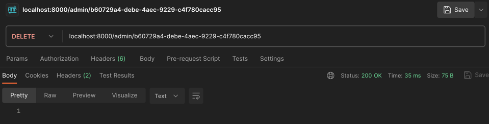
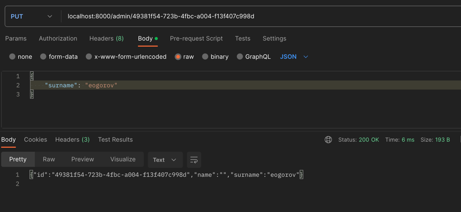

Api service for work with names

INSTRUCTIONS:
1. Для запуска программы перейти в api-service-test/deploy
2. Запустить докер, запустить команду make db
3. После того как команда отработает выполнить команду make run, для запуска сервиса

Пример запросов:
METHOD GET: localhost:8000/admin/add

METHOD GET: localhost:8000/users/

METHOD GET: localhost:8000/users/age

METHOD DELETE: localhost:8000/admin/

METHOD PUT: localhost:8000/admin/

HINTS:
1. Проверка на linter make lint

TASK:
Реализовать сервис, который будет получать по апи ФИО, из открытых апи обогащать
ответ наиболее вероятными возрастом, полом и национальностью и сохранять данные в
БД. По запросу выдавать инфу о найденных людях. Необходимо реализовать следующее
1. Выставить rest методы
2. Для получения данных с различными фильтрами и пагинацией
3. Для удаления по идентификатору 
4. Для изменения сущности
5. Для добавления новых людей в формате

{  
    "name": "Dmitriy",  
    "surname": "Ushakov",  
    "patronymic": "Vasilevich" // необязательно  
}

Корректное сообщение обогатить 
1. Возрастом - https://api.agify.io/?name=Dmitriy
2. Полом - https://api.genderize.io/?name=Dmitriy
3. Национальностью - https://api.nationalize.io/?name=Dmitriy
4. Обогащенное сообщение положить в БД postgres (структура БД должна быть создана
путем миграций)
5. Покрыть код debug- и info-логами 
6. Вынести конфигурационные данные в .env